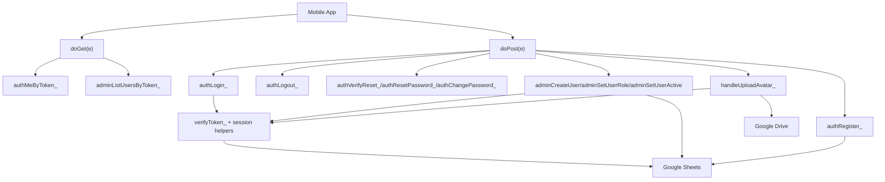

# C4 Code Level - Auth Backend (Apps Script)

## Overview
- Name: Auth Backend Action Service
- Description: Action-based auth/admin/profile API implemented in one Google Apps Script file
- Location: `BACKEND_AUTH.gs`
- Language: Google Apps Script (JavaScript)

## Code Elements

### Entrypoints and Routing
- `doGet(e)`
  - Location: `BACKEND_AUTH.gs:22`
  - Purpose: Routes GET actions (`auth_me`, `admin_list_users`, `test`, `test_drive`)
- `doPost(e)`
  - Location: `BACKEND_AUTH.gs:119`
  - Purpose: Routes POST actions for auth/admin/password/avatar flows

### Authentication and Session
- `authLogin_(body)`
  - Location: `BACKEND_AUTH.gs:194`
- `authLogout_(token)`
  - Location: `BACKEND_AUTH.gs:305`
- `verifyToken_(token)`
  - Location: `BACKEND_AUTH.gs:330`
- `authMeByToken_(token)`
  - Location: `BACKEND_AUTH.gs:1071`

### Account and Password
- `authRegister_(body)`
  - Location: `BACKEND_AUTH.gs:684`
- `authVerifyReset_(body)`
  - Location: `BACKEND_AUTH.gs:963`
- `authResetPassword_(body)`
  - Location: `BACKEND_AUTH.gs:776`
- `authChangePassword_(body)`
  - Location: `BACKEND_AUTH.gs:1343`

### Admin Operations
- `adminCreateUserAction_(body)`
  - Location: `BACKEND_AUTH.gs:404`
- `adminListUsersByToken_(token)`
  - Location: `BACKEND_AUTH.gs:1089`
- `adminSetUserRoleAction_(body)`
  - Location: `BACKEND_AUTH.gs:1119`
- `adminSetUserActiveAction_(body)`
  - Location: `BACKEND_AUTH.gs:1230`

### Avatar Upload
- `handleUploadAvatar_(body)`
  - Location: `BACKEND_AUTH.gs:1456`
- `updateUserAvatar_(userId, avatarUrl, fileId)`
  - Location: `BACKEND_AUTH.gs:1679`

### Sheet and Storage Helpers
- `getSheet_(name)`
  - Location: `BACKEND_AUTH.gs:487`
- `readTable_(sheet)`
  - Location: `BACKEND_AUTH.gs:494`
- `appendRow_(sheet, obj)`
  - Location: `BACKEND_AUTH.gs:520`
- `writeCell_(sheet, rowNumber, colNumber, value)`
  - Location: `BACKEND_AUTH.gs:526`

## Action Map

### GET Actions
- `auth_me`
- `admin_list_users`
- `test`
- `test_drive`

### POST Actions
- `auth_login`
- `auth_logout`
- `auth_me`
- `admin_list_users`
- `admin_create_user`
- `auth_register`
- `admin_set_user_role`
- `admin_set_user_active`
- `auth_verify_reset`
- `auth_reset_password`
- `auth_change_password`
- `auth_upload_avatar`

## Dependencies

### Internal
- Config constants in same file (`AUTH_SPREADSHEET_ID`, sheet names, token TTL)
- Helper layers for parsing, hashing, token/session cleanup, and sheet read/write

### External
- Google Sheets (`users`, `sessions`)
- Google Drive (avatar folder/files)
- Apps Script runtime APIs (`SpreadsheetApp`, `DriveApp`, `Utilities`)

## Relationships Diagram

## Related
- [Component - Auth Backend](./c4-component-auth-backend.md)
