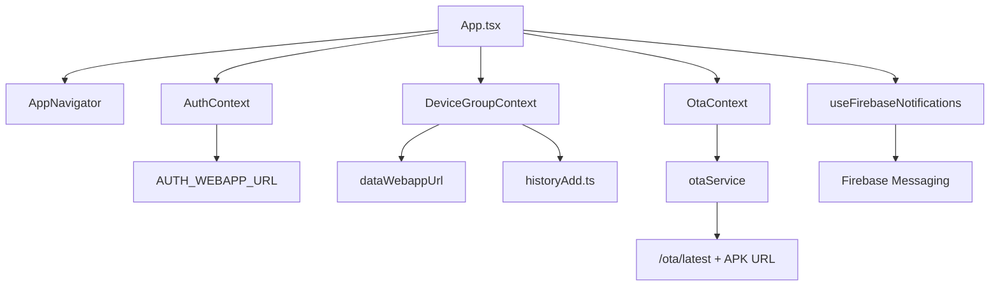

# C4 Code Level - Mobile Core

## Overview
- Name: Mobile Core Runtime
- Description: Core app startup, navigation, auth/session, data sync, OTA, and notification code
- Location: `App.tsx`, `src/navigation/`, `src/context/`, `src/services/`, `src/hooks/`, `src/utils/`
- Language: TypeScript

## Code Elements

### App Bootstrap
- `App(): JSX.Element`
  - Location: `App.tsx:12`
  - Purpose: Starts push hook and composes `ThemeProvider -> AuthProvider -> DeviceGroupProvider -> OtaProvider -> AppNavigator`

### Navigation
- `AppNavigator(): JSX.Element`
  - Location: `src/navigation/AppNavigator.tsx:24`
  - Purpose: Auth-gated stack navigation and screen graph

### Auth Context
- `postActionJson<T = any>(body: Record<string, any>): Promise<T>`
  - Location: `src/context/AuthContext.tsx:171`
- `login(username: string, password: string, deviceId = "rn"): Promise<{ ok: boolean; pending: boolean; message?: string }>`
  - Location: `src/context/AuthContext.tsx:396`
- `register(payload: RegisterPayload): Promise<AuthUser>`
  - Location: `src/context/AuthContext.tsx:460`
- `verifyReset(payload: VerifyResetPayload): Promise<VerifyResetResult>`
  - Location: `src/context/AuthContext.tsx:480`
- `resetPassword(payload: ResetPasswordPayload): Promise<boolean>`
  - Location: `src/context/AuthContext.tsx:504`
- `refreshMe(): Promise<boolean>`
  - Location: `src/context/AuthContext.tsx:520`
- `authedFetchJson<T>(args: AuthedFetchArgs): Promise<T>`
  - Location: `src/context/AuthContext.tsx:551`

### Device Data Sync
- `refreshAllData(): Promise<void>`
  - Location: `src/context/DeviceGroupContext.tsx:43`
  - Purpose: Calls data API `getAllData`, updates cache and state
- `appendHistoryAndSync(args): Promise<void>`
  - Location: `src/context/DeviceGroupContext.tsx:79`
  - Purpose: Optimistic append then force refresh

### OTA Service
- `fetchLatestOta(): Promise<OtaInfo | null>`
  - Location: `src/services/otaService.ts:45`
- `isNewerVersion(serverVersion: string, currentVersion: string): boolean`
  - Location: `src/services/otaService.ts:85`
- `downloadAndInstallApk(ota: OtaInfo, opts?: DownloadOptions): Promise<void>`
  - Location: `src/services/otaService.ts:375`

### OTA Context
- `startDownload(ota: OtaInfo): Promise<void>`
  - Location: `src/context/OtaContext.tsx:55`

### History Write Utility
- `isValidDdMmYy(value: string): boolean`
  - Location: `src/utils/historyAdd.ts:17`
- `todayDdMmYy(now = new Date()): string`
  - Location: `src/utils/historyAdd.ts:10`
- `postAppendHistoryToAppScript(args): Promise<{ ok: true } | { ok: false; message: string }>`
  - Location: `src/utils/historyAdd.ts:35`

### Notification Adapter
- `useFirebaseNotifications(): void`
  - Location: `src/hooks/useFirebaseNotifications.ts:17`
- `showServerStatusNotification(title: string, body: string): Promise<void>`
  - Location: `src/utils/notifications.ts:14`

## Dependencies

### Internal
- `src/config/apiConfig.ts` for endpoint and key constants
- Cross-context dependencies among Auth, DeviceGroup, OTA, and navigation layers

### External
- React Native ecosystem: navigation, MMKV, Notifee, Firebase messaging
- Filesystem and viewer APIs for OTA package handling

## Relationships Diagram

## Related
- [Component Index](./c4-component.md)
