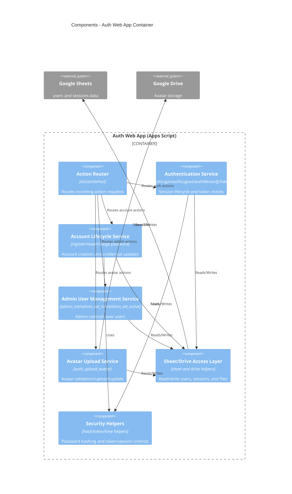

# C4 Component - Auth Web App Container

## Overview
- Name: Auth Web App Components
- Type: API Service Components
- Technology: Google Apps Script
- Primary source: `BACKEND_AUTH.gs`

## Components

### Action Router
- Purpose: Route `doGet/doPost` requests by `action` to specific handlers
- Key entrypoints:
  - `doGet(e)`
  - `doPost(e)`

### Authentication Service
- Purpose: Credential verification, token issuance, logout, session checks
- Key handlers:
  - `authLogin_`
  - `authLogout_`
  - `authMeByToken_`
  - `verifyToken_`

### Account Lifecycle Service
- Purpose: Registration and password flows
- Key handlers:
  - `authRegister_`
  - `authVerifyReset_`
  - `authResetPassword_`
  - `authChangePassword_`

### Admin User Management Service
- Purpose: User list, role updates, active-state toggling
- Key handlers:
  - `adminListUsersByToken_`
  - `adminSetUserRoleAction_`
  - `adminSetUserActiveAction_`
  - `adminCreateUserAction_`

### Avatar Upload Service
- Purpose: Validate and upload avatar file, update user avatar metadata
- Key handlers:
  - `handleUploadAvatar_`
  - `updateUserAvatar_`

### Sheet/Storage Access Layer
- Purpose: Read/write structured data from Google Sheets and Drive
- Key helpers:
  - `getSheet_`
  - `readTable_`
  - `appendRow_`
  - `writeCell_`

### Security Helpers
- Purpose: Hashing, token and time helpers, cleanups
- Key behavior:
  - Password hash checks with salt
  - Session cleanup and revocation
  - Token TTL enforcement

## Interfaces

### Auth Action API
- Protocol: HTTPS JSON action-based
- Actions:
  - `auth_login`, `auth_logout`, `auth_me`
  - `auth_register`, `auth_verify_reset`, `auth_reset_password`, `auth_change_password`
  - `auth_upload_avatar`

### Admin Action API
- Protocol: HTTPS JSON action-based
- Actions:
  - `admin_list_users`
  - `admin_set_user_role`
  - `admin_set_user_active`
  - `admin_create_user`

## Dependencies
- Google Sheets (`users`, `sessions`)
- Google Drive (avatar folder/file operations)

## Component Diagram

## Related
- [Component Index](./c4-component.md)
- [Container Diagram](./c4-container.md)
