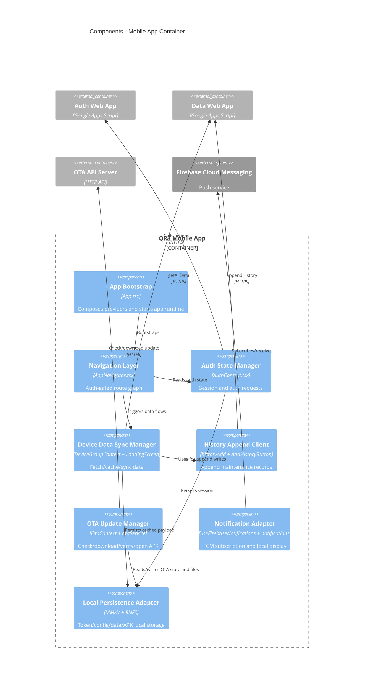

# C4 Component - Mobile App Container

## Overview
- Name: QR3 Mobile App Components
- Type: Mobile Application Components
- Technology: React Native + TypeScript

## Components

### App Bootstrap and Provider Composition
- Purpose: Initialize global runtime layers and app-wide contexts
- Source:
  - `App.tsx`

### Navigation Layer
- Purpose: Route orchestration and auth-gated screen access
- Source:
  - `src/navigation/AppNavigator.tsx`
  - `src/types/navigation.ts`

### Authentication State Manager
- Purpose: Login/logout/session, token persistence, auth-protected request helper
- Source:
  - `src/context/AuthContext.tsx`

### Device Data Sync Manager
- Purpose: Load full equipment payload, cache local state, sync after history append
- Source:
  - `src/context/DeviceGroupContext.tsx`
  - `src/screens/LoadingScreen.tsx`

### History Append Client
- Purpose: Post maintenance updates to backend and return write result
- Source:
  - `src/utils/historyAdd.ts`
  - `src/components/maintenance/AddHistoryButton.tsx`

### OTA Update Manager
- Purpose: Check OTA metadata, download APK, verify integrity/signature policy, open installer
- Source:
  - `src/context/OtaContext.tsx`
  - `src/services/otaService.ts`

### Notification Adapter
- Purpose: Request push permission, subscribe FCM topic, display local notifications
- Source:
  - `src/hooks/useFirebaseNotifications.ts`
  - `src/utils/notifications.ts`

### Local Persistence Adapter
- Purpose: Store token/config/data and track OTA install state
- Technology: MMKV + device file system
- Source:
  - `src/config/apiConfig.ts`
  - `src/services/otaService.ts`

## Interfaces

### Auth API Client Interface
- Protocol: HTTPS JSON action-based
- Key operations: login, me, logout, register, password reset/change, admin actions

### Data API Client Interface
- Protocol: HTTPS
- Key operations: getAllData, appendHistory

### OTA API Client Interface
- Protocol: HTTPS
- Key operations: fetchLatestOta, download APK

### Push Notification Interface
- Protocol: FCM topic + local notification API

## Dependencies
- Auth Web App
- Data Web App
- OTA API server
- Firebase Cloud Messaging
- Google Sheets and Google Drive (indirect via APIs)

## Component Diagram

## Related
- [Component Index](./c4-component.md)
- [Container Diagram](./c4-container.md)
