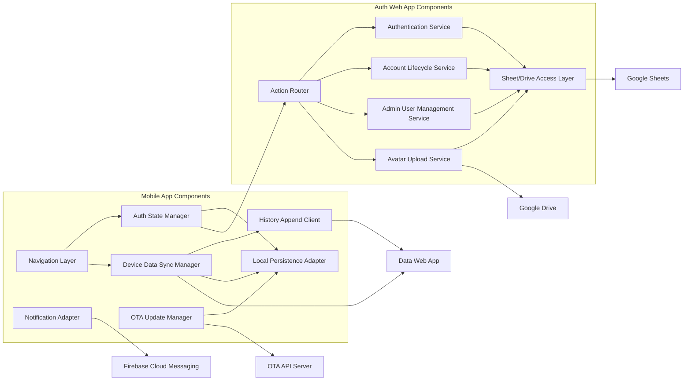

# C4 Component Index - QR3 Maintenance Platform

## System Components

### Mobile Application Components
- Description: App bootstrap, navigation, auth state, sync/history, OTA, notifications, local persistence
- Documentation: [c4-component-mobile-app.md](./c4-component-mobile-app.md)

### Auth Backend Components
- Description: Action routing, auth/session management, admin actions, password/account flows, avatar upload, Sheets/Drive integration
- Documentation: [c4-component-auth-backend.md](./c4-component-auth-backend.md)

## Component Relationships

## Related
- [Context Diagram](./c4-context.md)
- [Container Diagram](./c4-container.md)
- [Code-Level Mobile](./c4-code-mobile-core.md)
- [Code-Level Auth Backend](./c4-code-auth-backend-apps-script.md)
