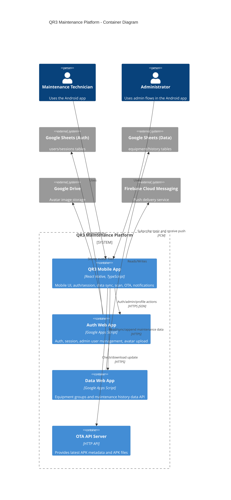

# C4 Container - QR3 Maintenance Platform

## Containers

### Mobile App Container
- Name: QR3 Android Mobile App
- Type: Mobile Application
- Technology: React Native 0.82, TypeScript, React Navigation, MMKV, Notifee, RNFS
- Deployment: Installed APK on Android devices (debug/release/OTA package)

### Auth API Container
- Name: Auth Web App
- Type: API Service
- Technology: Google Apps Script
- Deployment: Google Apps Script Web App endpoint

### Data API Container
- Name: Data Web App
- Type: API Service
- Technology: Google Apps Script (external repository/endpoint)
- Deployment: Google Apps Script Web App endpoint

### OTA API Container
- Name: OTA API Server
- Type: API + Static File Service
- Technology: HTTP API server (Node-based API expected by client)
- Deployment: Hosted server endpoint

## Dependencies

### External Data and Messaging
- Google Sheets (users/sessions + equipment/history storage)
- Google Drive (avatar file storage)
- Firebase Cloud Messaging (push topic delivery)

## Interfaces

### Mobile App -> Auth API (`AUTH_WEBAPP_URL`)
- Protocol: HTTPS JSON (action-based)
- Main operations:
  - `auth_login`
  - `auth_logout`
  - `auth_me`
  - `auth_register`
  - `auth_verify_reset`
  - `auth_reset_password`
  - `auth_change_password`
  - `auth_upload_avatar`
  - `admin_list_users`
  - `admin_set_user_role`
  - `admin_set_user_active`

### Mobile App -> Data API (`dataWebappUrl`)
- Protocol: HTTPS
- Main operations:
  - `GET ?action=getAllData&sheetId=...`
  - `POST { action: "appendHistory", sheetId, sheetName, ... }`

### Mobile App -> OTA API (`otaApiBaseUrl`)
- Protocol: HTTPS
- Main operations:
  - `GET /ota/latest`
  - APK download URL returned by OTA metadata

### Mobile App <- FCM
- Protocol: FCM topic subscription
- Main operations:
  - subscribe topic: `server-status`
  - foreground message -> local notification display

## Container Diagram

## API Specs
- [Auth API spec](./apis/auth-webapp-api.yaml)
- [Data API spec](./apis/data-webapp-api.yaml)
