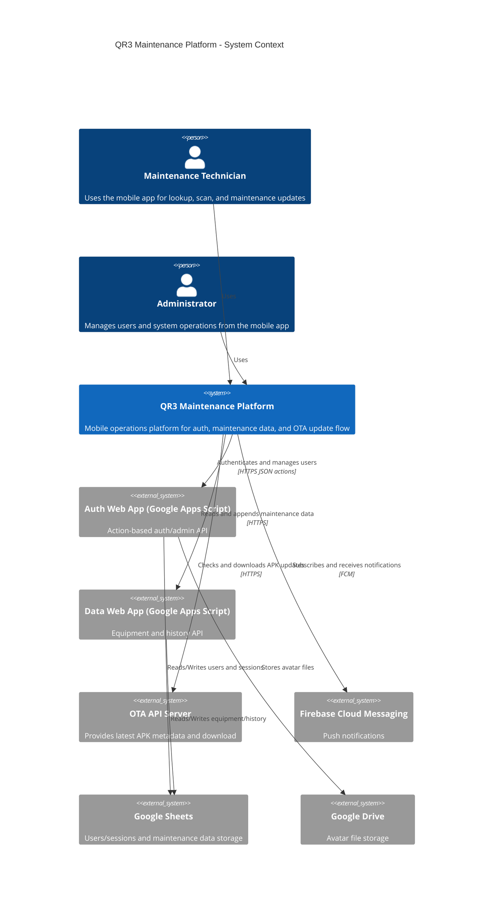

# C4 Context - QR3 Maintenance Platform

## System Overview

### Short Description
QR3 is a mobile-first maintenance platform for equipment lookup, maintenance history, account management, and Android OTA updates.

### Long Description
The system provides an Android React Native app used by technicians and administrators in factory operations. The app authenticates users through a Google Apps Script auth backend, reads equipment/group/history data from a data backend, supports history append operations, receives operational notifications via Firebase Cloud Messaging, and installs Android updates from an OTA server. User and session data are stored in Google Sheets, while avatar files are stored in Google Drive.

## Personas

### Maintenance Technician
- Type: Human User
- Goals:
  - Sign in and stay authenticated
  - Scan QR and find device details fast
  - Read maintenance history and append new maintenance notes
  - Receive important server-status notifications

### Administrator
- Type: Human User
- Goals:
  - Manage users (list, role, active state)
  - Support account lifecycle (reset password, profile updates)
  - Keep app clients updated with OTA releases

### External Integration Services
- Type: Programmatic User / External Systems
- Description:
  - Firebase Cloud Messaging pushes notifications
  - Google Sheets and Google Drive act as managed persistence services

## Key Features
- Authentication and session management
- Equipment group and history read/sync
- History append from mobile UI
- Admin user management
- Profile avatar upload
- Android OTA check/download/install
- Push notification handling

## User Journeys

### Login and Session Journey (Technician)
1. User submits username/password in mobile app.
2. Mobile app calls auth web app with `action=auth_login`.
3. Auth backend validates user in `users` sheet and creates session in `sessions` sheet.
4. Mobile app stores token/session locally and unlocks app screens.
5. Mobile app periodically validates session via `action=auth_me`.

### Device Data Journey (Technician)
1. App bootstrap or manual sync triggers `action=getAllData`.
2. Data web app returns equipment/groups/history payload.
3. Mobile app caches payload and renders device/history screens.
4. User adds history note, app sends `action=appendHistory`.
5. App optimistically updates UI and then refreshes data from server.

### Admin User Management Journey (Administrator)
1. Admin opens user management screen.
2. Mobile app calls `action=admin_list_users`.
3. Admin changes role/active state using `admin_set_user_role` or `admin_set_user_active`.
4. Auth backend updates `users` sheet and returns updated record.

### OTA Update Journey (Technician/Admin)
1. User checks update in Settings.
2. Mobile app requests `/ota/latest` from OTA API.
3. App downloads APK, verifies checksum/signature policy, and opens installer.
4. User installs updated app package on device.

## External Systems and Dependencies

### Google Apps Script Auth Web App
- Type: External API Service
- Purpose: Auth, sessions, user admin, password flows, avatar upload

### Google Apps Script Data Web App
- Type: External API Service
- Purpose: `getAllData` and `appendHistory` for equipment/maintenance data

### OTA API Server
- Type: External API Service
- Purpose: Metadata endpoint and APK hosting for Android updates

### Google Sheets
- Type: External Data Store
- Purpose: Users/sessions/auth data and equipment/history data

### Google Drive
- Type: External File Storage
- Purpose: Avatar image storage and public link serving

### Firebase Cloud Messaging
- Type: External Messaging Service
- Purpose: Push notifications (`server-status` topic)

## System Context Diagram

## Related Documentation
- [Container Documentation](./c4-container.md)
- [Component Documentation](./c4-component.md)
